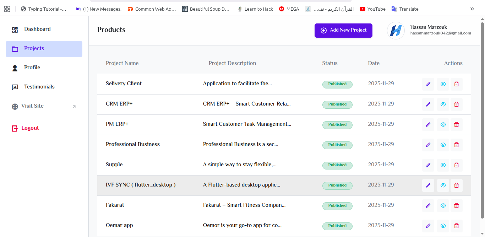

# 🚀 Ultimate Portfolio CMS


## 📖 Project Description

**Ultimate Portfolio CMS** is a comprehensive, full-stack Content Management System designed specifically for developers and creative professionals. It serves two main purposes:

1.  **Public Showcase:** A high-performance, SEO-friendly frontend to display your portfolio, skills, and resume to the world.
2.  **Admin Control:** A secure, feature-rich dashboard that allows you to manage every aspect of your content—from projects and testimonials to personal bio and analytics—without writing a single line of code.

Built with the latest **Laravel 12** and **Livewire 3**, the system adopts a **Hybrid Architecture**: using **Tailwind CSS** for a modern public interface and **Bootstrap 5** for a robust, familiar administrative backend. It simplifies the task of maintaining an online presence, offering built-in visitor tracking and a seamless feedback loop with clients.

## 📸 Screenshots

|           Admin Dashboard            |            Project Editor             |
| :----------------------------------: | :-----------------------------------: |
|  |         |
|         **Profile Settings**         |           **Testimonials**            |
|        |  |

> _Note: Please ensure the images are placed in a `doc/` folder in your root directory._

## ✨ Key Features

### 📊 Built-in Analytics

-   **Visitor Tracking:** The system logs unique daily visits based on IP address and User Agent (`ProfileVisit` model).
-   **Dashboard Stats:** View real-time counters for total Portfolio Views, Projects, and Skills.

### 📩 Advanced Feedback System

-   **Smart Notifications:** Automated emails (`FeedbackMail`) sent to Admin upon new submissions.
-   **Direct Reply:** The email system sets the `Reply-To` header to the client's address for one-click responses.
-   **Database Storage:** All messages are saved as `Testimonials` with moderation status (`Pending`, `Accept`, `Spam`).

### 💼 Project Management

-   **Smart Catalog:** CRUD functionality for projects with `draft` or `published` status.
-   **Media Support:** Upload optimized project covers using the `app-image` media collection.
-   **Store Links:** Dedicated fields for **Google Play**, **App Store**, and **GitHub Repo**.
-   **JSON Tagging:** Dynamic handling of "Technologies" and "Features" stored as JSON arrays.

### 👤 Dynamic Profile

-   **Resume Management:** Upload CVs in **PDF** (`dev-cv` collection).
-   **Skill Matrix:** Manage "Technical" and "Soft Skills" tags dynamically (JSON storage).
-   **Branding:** Seamlessly update Avatar and Hero Banner images.
-   **Social Hub:** Integrated inputs for LinkedIn, GitHub, Facebook, and WhatsApp.

## ⚙️ Tech Stack

-   **Backend:** Laravel 12.x (Bleeding Edge).
-   **Frontend Logic:** Livewire 3.7 (SPA Mode).
-   **Admin UI:** Bootstrap 5.3 + Remix Icons.
-   **Public UI:** Tailwind CSS 4.0 + Vite 7.0.
-   **Database:** MySQL.
-   **File Storage:** Spatie Media Library.
-   **Testing:** Pest PHP.

## 🚀 Installation & Setup

Follow these steps to download and run the project on your local machine.

### 1. Download from GitHub

Open your terminal and run the following command to clone the repository:

```bash
git clone [https://github.com/your-username/portfolio-cms.git](https://github.com/your-username/portfolio-cms.git)
cd portfolio-cms
```
